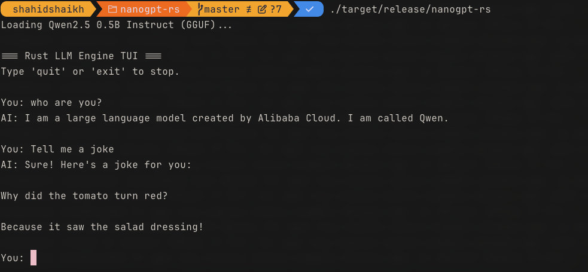

## nanoGPT - Transformer model in Pytorch and Inference in Rust

The notebook contains implementation for transformers architecture and loading weights from GPT2 model. 

Since GPT2 is a pre-trained model and not gone through RLHF, we are using Qwen open weights model for inference.

The inference engine is written in Rust to generate a binary that can run faster and cross-compatible. It has a small TUI by using which we can talk to a model.



Download the weights using this command to run the inference.

```
curl -L -o qwen2.5-0.5b-instruct-q4_k_m.gguf https://huggingface.co/Qwen/Qwen2.5-0.5B-Instruct-GGUF/resolve/main/qwen2.5-0.5b-instruct-q4_k_m.gguf
```

This is a a entry to learning sprint on figuring out LLM internals.
